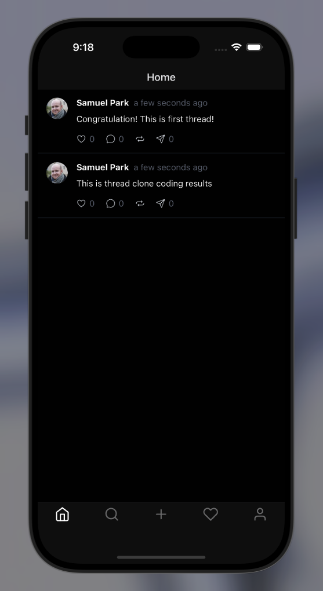

# Thread

    
    <ul>
        <li>Expo</li>
        <li>Expo Router</li>
        <li>React Native</li>
        <li>Nativewind (Tailwindcss)</li>
        <li>Tanstack React Query</li>
        <li>Supabase</li>
    </ul>

